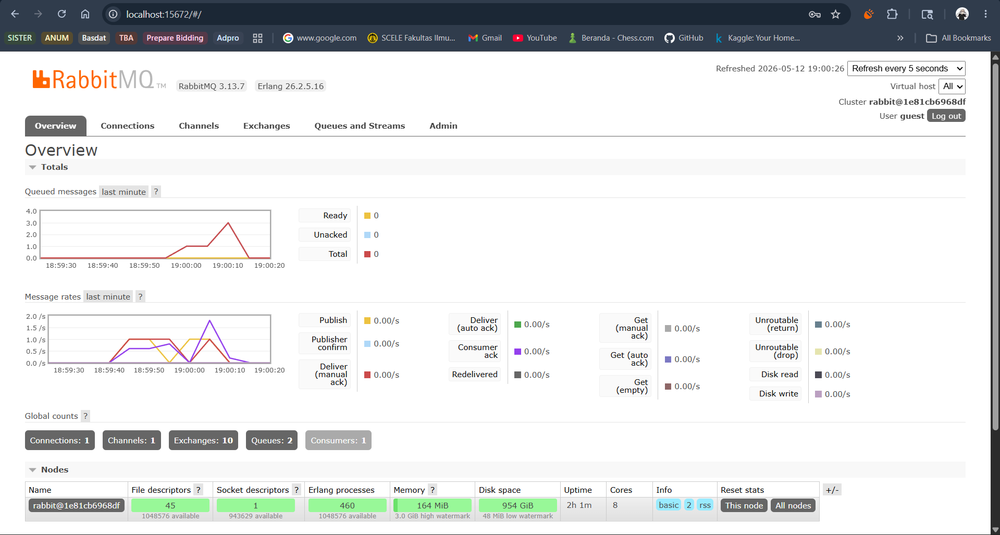

1. Apa itu AMQP?
AMQP (Advanced Message Queuing Protocol) itu ibaratnya aturan atau bahasa standar yang dipakai oleh berbagai program buat kirim-kiriman pesan lewat sebuah "kantor pos" (dalam hal ini message broker seperti RabbitMQ). Bayangin aja AMQP itu semacam format baku untuk membungkus dan mengirim paket, supaya "kantor pos"-nya ngerti paket dari programmu ini harus diantar ke mana dan bagaimana cara menanganinya.

2. What does it mean? guest:guest@localhost:5672 , what is the first guest, and what is the second guest, and what is localhost:5672 is for?

Ini adalah URL koneksi, ibaratnya "alamat lengkap beserta kunci" buat komputermu bisa masuk ke server RabbitMQ. Kalau dibedah, artinya begini:

guest yang pertama: Ini adalah Username (nama pengguna) bawaan (default) untuk masuk ke RabbitMQ.

guest yang kedua (setelah titik dua): Ini adalah Password (kata sandi) bawaan yang dipasangkan dengan username tadi.

localhost: Ini adalah alamat tempat "kantor pos"-nya berada. Artinya, server RabbitMQ tersebut sedang berjalan di komputermu sendiri, bukan di komputer atau server orang lain di internet.

5672: Ini adalah Port atau ibarat "nomor jalur pintu masuk". Komputer itu punya ribuan "pintu" untuk berbagai aplikasi, dan 5672 adalah pintu masuk standar yang khusus dipakai oleh RabbitMQ untuk mendengarkan komunikasi AMQP.

Ini terjadi karena publisher mengirim pesan jauh lebih cepat (tanpa delay) daripada kemampuan subscriber memprosesnya (ada delay 1 detik). Akhirnya, pesan-pesan tersebut menumpuk dan ngantri di dalam RabbitMQ message broker
